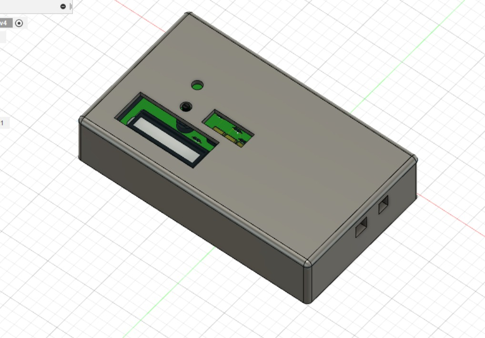
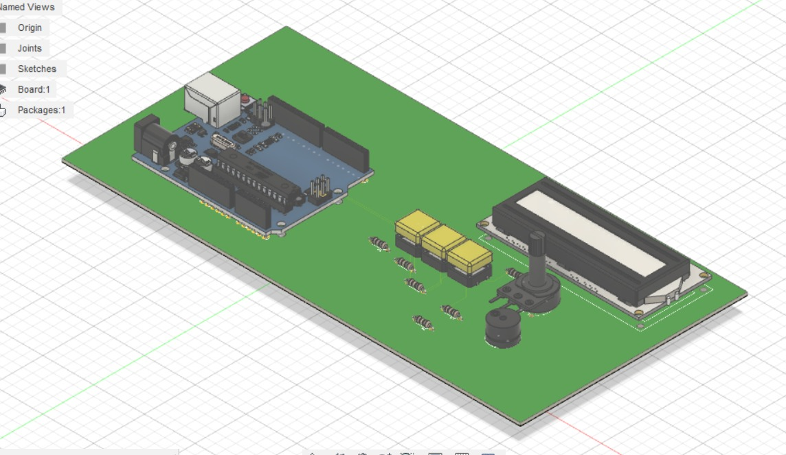
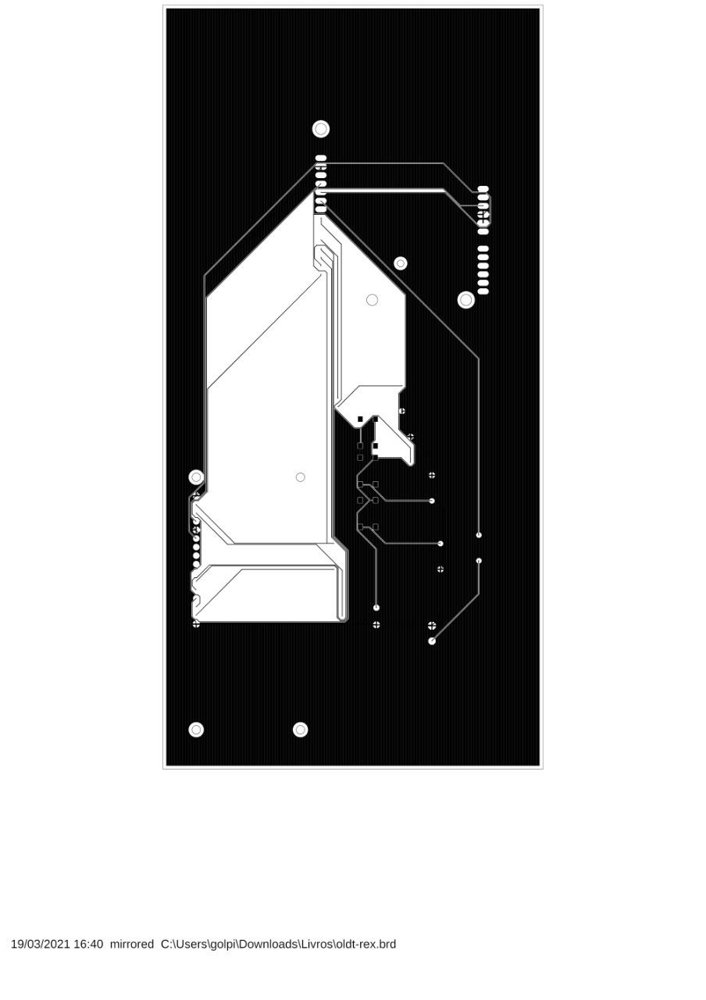
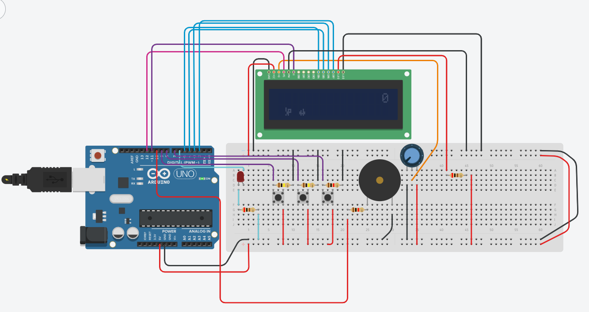

# SEBIX

Réplica do Jogo do Dinossauro (Chrome) em um Arduino.

<h2> Descrição </h2>

Jogo do dinossauro da Google feito no Arduino implementado com uma LCD para display e botões para controle no jogo.

<h2> Tecnologias Usadas </h2>

Para o processamento do jogo usamos um Arduino Uno R3. Existe um LCD 16x2 para display do dinossauro e obstáculos do jogo. Três botões para controle do jogo. Um potenciômetro para controle do brilho do Arduino. Um buzzer para emitir sons em certos momentos do jogo. Foi usado a linguagem C++ para programação no Arduino, com a biblioteca Liquid Crystal. O software Eagle foi usado para produção da PCB e o Fusion para a produção de uma caixa para armazenar todos os componentes.

<h2> Esquemático<h2>
  
  

<h2> Como Usar </h2>

No menu do jogo é possível acessar uma área de instruções, mas o botão da esquerda sobe o cursor no menu e faz com que o dinossauro pule, o botão do meio abaixa o cursor no menu e faz com que o dinossauro abaixe e o botão da direita confirma a opção no menu e renicia o jogo.

<h2> Imagem da Simulação<h2>
  
  
  
<h2> Membros </h2>

<ul>
  <li>Beatriz Rocha</li>
  <li>David Dias</li>
  <li>Gabriel Rebelo</li>
  <li>Lucas Martins</li>
</ul>

<h2> Agradecimentos </h2>

<ul>
  <li>Érika Cardoso</li>
</ul>
